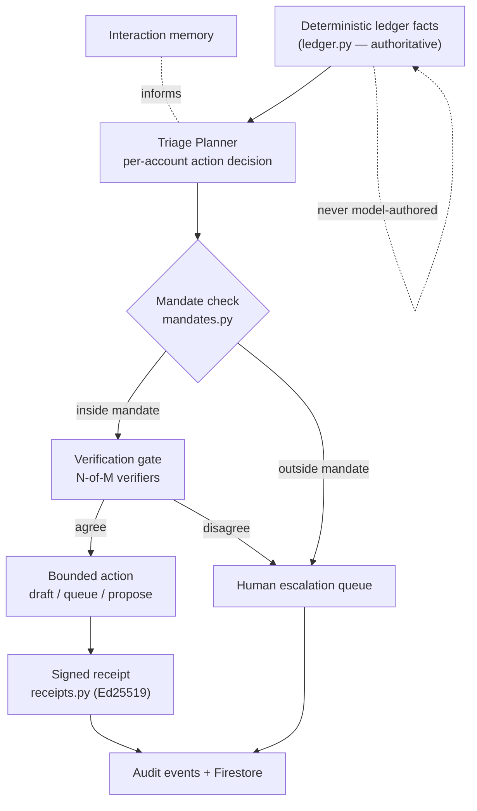

# Agentic Evolution Roadmap

A plan to add genuine agentic-AI capability to FeeOps while preserving the monetary
safety model documented in [agent-framework.md](agent-framework.md) and
[llm-safety.md](llm-safety.md). Concepts marked **(PayGuard)** adapt agentic-payment
guardrail patterns — Active Mandates, cryptographic authorization, tiered autonomy,
verification consensus, and verifiable receipts.

## Guiding Principle

Today FeeOps *observes and drafts*; a human does everything consequential. "More agentic"
here does **not** mean handing money decisions to a model. It means letting the agent
**act autonomously within cryptographically-bounded limits**, and escalate everything
else to the human queue that already exists. Money stays deterministic and integer-paise;
the LLM never authors a monetary value. Every new capability is added *behind* a guardrail,
not by loosening one.

> The project's stated position — "there is no benefit in allowing an autonomous model to
> choose tools or mutate financial state" — remains true for *money*. This roadmap makes
> the agent autonomous over **process** (which case to act on, which tier of action, when
> to escalate), not over **arithmetic**.

## What "Agentic" Means Here — Capability Model

| Dimension | Today | Target |
|---|---|---|
| Perception | Reads fixtures / Firestore run state | unchanged (already strong) |
| Action / tool use | 1 read-only tool (`run_fee_workflow`) | guarded action tools, each mandate-checked |
| Autonomy | None — drafts only | tiered: auto-act inside a mandate, escalate outside **(PayGuard)** |
| Planning / reasoning | Fixed linear pipeline | adaptive per-account triage decisions |
| Multi-agent roles | Single agent | specialist verifiers + consensus gate **(PayGuard)** |
| Memory | Per-run + payment history for scoring | cross-run interaction/decision memory |
| Verifiability | Plain audit rows | signed mandates + signed receipts **(PayGuard)** |
| Reactivity | Firestore `onSnapshot` | + scheduled daily triage, activity feed |
| Reflection / self-check | `validate_draft` only | generalized verify-and-retry loop |

## Target Architecture

---

## Phase 0 — Trust Substrate (Mandates + Signed Receipts) **(PayGuard)**

The foundation everything else stands on. No behavior change for users yet; this makes
authority and actions *machine-checkable and tamper-evident*.

**New files**
- `backend/mandates.py` — the **Active Mandate** model: an authorization object bound by
  explicit constraints (`maxAmountPaise`, `ageingBuckets`, `validFrom`/`validUntil`,
  `singleUse`, `scope` e.g. `REMINDER` / `CONCESSION` / `WAIVER`, `grantedBy`). Plus a
  pure-function evaluator `evaluate(action, mandate, as_of) -> ALLOW | ESCALATE | DENY`.
- `backend/receipts.py` — Ed25519 signing/verification. `sign_event(event, key)` and
  `verify_event(event) -> bool`. Keys via env, never committed (mirror the
  service-account handling already in `.gitignore`).

**Touches**
- `agent_runner.py` — wrap each emitted audit event in a signed receipt.
- `firestore.rules` — store mandate references + signatures; reject action writes lacking a
  valid mandate reference.

**Done when** every concession/waiver/reminder in `output.json` carries a `mandateRef` and a
verifiable `signature`, and `verify_event` passes for the whole audit trail.

## Phase 1 — Bounded-Action Agent (read-only → act-within-limits) **(PayGuard)**

The core agentic leap: the agent stops only drafting and starts *doing* things — inside
mandate limits.

**Touches**
- `feeops_adk/agent.py` — expand the tool surface beyond `run_fee_workflow`:
  - `draft_reminder_for(student_id)` — draft only (existing path), now mandate-logged.
  - `queue_reminder(student_id)` — moves a draft into the review/send queue **only if** an
    active `REMINDER` mandate covers the amount + ageing bucket; otherwise returns an
    escalation.
  - `propose_concession(student_id, ...)` / `propose_waiver(...)` — creates a *proposal*
    record (never applies to the ledger) gated by mandate scope.
  - `escalate_case(student_id, reason)` — pushes to the human queue with structured reason.
- Tiered-autonomy policy table: e.g. `0-30` bucket **and** amount ≤ mandate cap → auto-queue
  draft; `31-60` → auto-draft + flag; `60+` or waiver-touching → always escalate.

**Done when** a demo run auto-queues low-risk reminder drafts and escalates the rest, with
every decision tied to a mandate and a signed receipt. **This is the phase that makes the
project visibly "agentic."**

## Phase 2 — Adaptive Triage Planner (reasoning over state)

Replace the fixed pipeline tail with per-account decisioning, so the agent *chooses* what to
do rather than running one hard-coded sequence.

**New file**
- `backend/collections_planner.py` — iterate the collection worklist; for each account decide
  an action plan from `{remind, escalate, propose_plan, wait}` using deterministic signals
  (ageing, amount, plan compliance, history). The LLM is used **only to explain the rationale
  in words**, never to pick amounts or override the deterministic signal.

**Touches**
- `agent_runner.py` — emit an `agentDecisions` array: `{studentId, chosenAction, rationale,
  mandateRef, tier}`.

**Done when** the run output includes an explainable decision per worklisted account, and the
decisions are reproducible from the deterministic signals.

## Phase 3 — Multi-Agent Verification Gate (scaled-down consensus) **(PayGuard)**

Adapt the Byzantine-consensus idea to a practical **N-of-M verification quorum** — an action
proceeds only when the required independent checks agree. This formalizes what
`validate_draft` half-does today.

**New file**
- `backend/verification_gate.py` — roles:
  - `LedgerVerifier` (deterministic recompute of the amount/due date),
  - `PolicyVerifier` (mandate + scope),
  - `CommsDrafter` (LLM wording),
  - `ComplianceReviewer` (guardrail: review-only, nothing sent).
  Action allowed only on the configured quorum (e.g. Ledger + Policy **must** pass).

**Done when** each action receipt carries a `consensus` record listing which verifiers passed.

## Phase 4 — Memory & Feedback Learning

Give the agent continuity across runs so it behaves like it *remembers*, without ever
mutating money logic automatically.

**New file / store**
- `backend/interaction_memory.py` — records reminders queued, escalations raised, and guardian
  responsiveness across runs. Feeds next-run prioritization and tone ("reminded twice → escalate").
- Reviewer-override log → a **tuning signal** for reconciliation confidence thresholds. Logged
  for human-reviewed tuning; it never silently changes `reconciliation.py`.

**Done when** a second run visibly re-prioritizes based on prior-run actions, with the memory
source shown in the decision rationale.

## Phase 5 — Continuous Operation + Observability

Make it run and be watchable like an operating agent.

**Touches**
- Scheduled daily triage run (Cloud Run job / scheduler) that produces a fresh decision set.
- `frontend/src/` — an **Agent Operations** tab: activity feed (decisions, escalations,
  receipts) and metrics — auto-actioned vs escalated, mandate-hit rate, receipt-verify rate,
  LLM validation pass rate.

**Done when** the dashboard shows a live agent-activity feed and the safety metrics above.

---

## Non-Negotiable Safety Invariants (unchanged across all phases)

1. All monetary arithmetic stays in deterministic integer-paise Python. The LLM never authors,
   rounds, or alters a monetary value.
2. No autonomous money movement — no collection, disbursement, or "sending." Reminders remain
   drafts; a human approves anything that leaves the system.
3. Every autonomous action is bounded by an Active Mandate and recorded as a signed receipt.
   No mandate ⇒ no action ⇒ escalate.
4. `validate_draft` (and the Phase 3 gate) remain mandatory; failing wording falls back to the
   deterministic template.
5. Concessions, waivers, and plans still require recorded authority — now expressed *as
   mandates* rather than trusted fixture rows.

## Testing Strategy

- Extend `test_finance_invariants.py`: money invariants must hold unchanged after every phase.
- `test_mandates.py` — allow / escalate / deny boundaries; expiry; single-use exhaustion.
- `test_receipts.py` — sign→verify round-trip; tampered event fails verification.
- `test_verification_gate.py` — quorum pass/fail; ledger-verifier veto always wins.
- `test_planner.py` — decisions are deterministic given fixed signals; LLM absence still yields
  a valid (template-explained) decision.

## New Files at a Glance

| File | Phase | Purpose |
|---|---|---|
| `backend/mandates.py` | 0 | Active Mandate model + evaluator |
| `backend/receipts.py` | 0 | Ed25519 signed audit receipts |
| `backend/collections_planner.py` | 2 | Per-account adaptive triage |
| `backend/verification_gate.py` | 3 | N-of-M verifier quorum |
| `backend/interaction_memory.py` | 4 | Cross-run memory + tuning signals |
| `frontend/src/AgentOps*` | 5 | Activity feed + safety metrics tab |

## Recommended Sequencing for the Assessment

- **Biggest visible win, smallest risk: Phase 0 → Phase 1.** Together they convert the
  read-only observer into a bounded-autonomy agent that *acts* and *escalates*, with a
  verifiable audit trail. This is the demonstrable "it's agentic now" moment and it strengthens
  (rather than weakens) the safety story the assessment rewards.
- **Then Phase 2** for the reasoning/planning narrative.
- Phases 3–5 are depth: consensus, memory, and live observability. Land them if time allows.

## Risks & Mitigations

- *Scope creep into autonomy over money* → the invariants section is the hard boundary; mandates
  cap scope to `REMINDER` / `CONCESSION-proposal` / `WAIVER-proposal`, never `LEDGER`.
- *Key management for signing* → env-only keys, `.gitignore`'d, same pattern as the existing
  service account; document rotation in `admin-runbook.md`.
- *LLM drift in rationale text* → rationale is explanatory only and never feeds a monetary field;
  Phase 3 ledger-verifier veto is authoritative.
